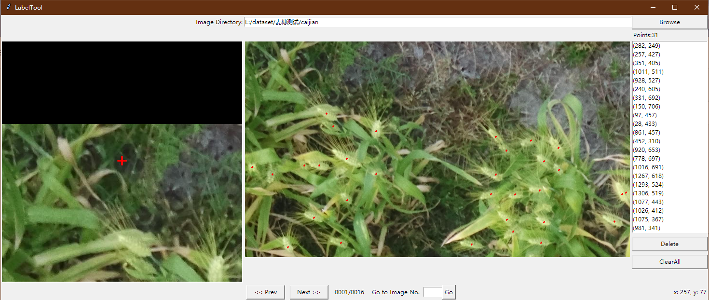

# label_img_point

Annotate images for counting problems such as crowd counting.
It is written in Python and uses tkinter for its graphical interface.

Points are saved as txt files.

## Installation

Linux/Ubuntu/Mac requires at least Python 3

Open cmd and go to the label_img_point directory

`python label_tool.py`

## Usage

### Steps

1. Build and launch using the instructions above.
2. Click `Browser`.
3. Click and release left mouse to mark a point in picture.
4. You can use `delete` button to delete a point or use `ClearAll` button to clear all points.

### HotKey

| key | function       |
| :-- | :------------- |
| a   | Previous image |
| d   | Next image     |

## How to contribute

Send a pull request

## License

Free software: MIT license

Citation: zoro528. Git code (2020). https://github.com/Zoro528/label_img_point
